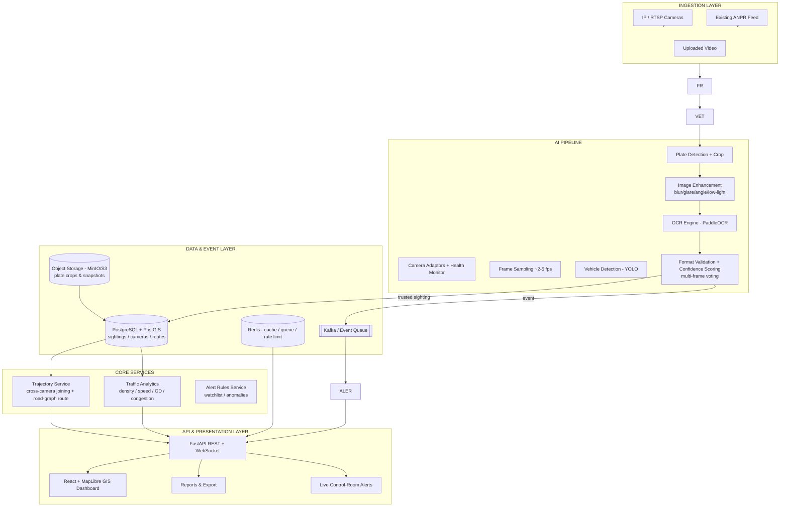
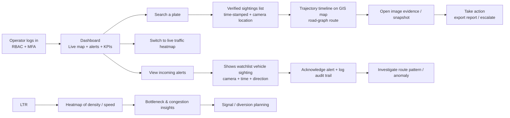
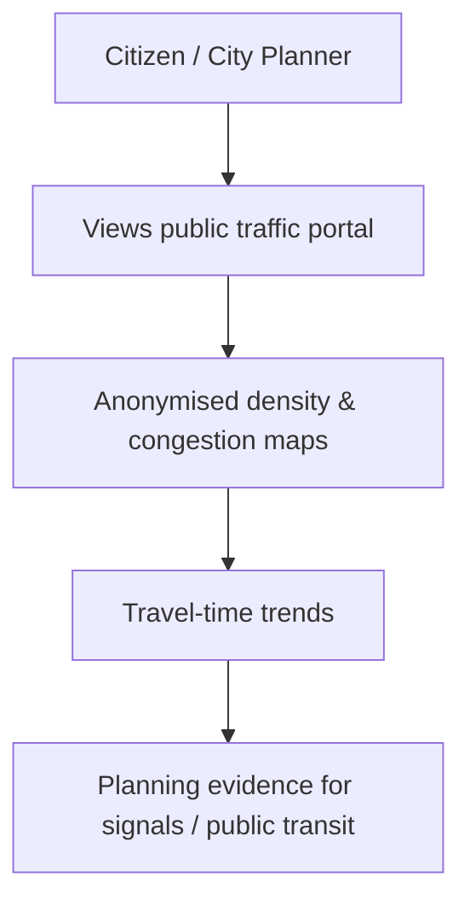
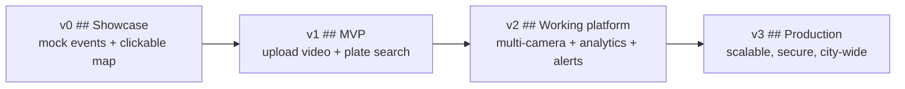
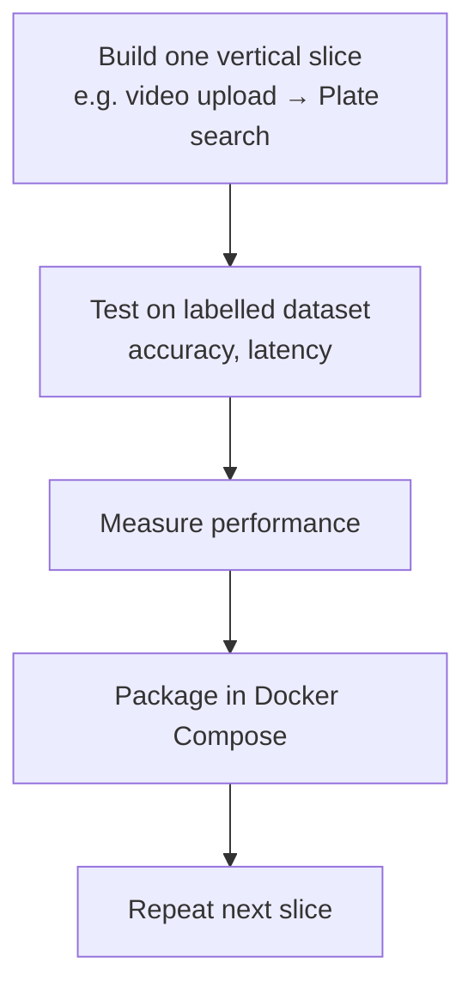

# City-Wide ANPR Platform — Architecture, Methodology, Feasibility & Impact

> Companion document to the SIH 2026 brief (Problem Statement 26127). This file captures the proposed **system architecture**, the **end-user flow**, the **technology stack**, the **build methodology**, and an honest **feasibility + risk** analysis with the expected **impact and benefits**.

---

## 1. System Architecture

The platform is designed as a set of **loosely coupled services** connected by an event stream. Cameras produce raw frames; AI services turn frames into **trusted sighting events**; backend services join those events across space and time; a GIS dashboard and alerts expose the results to operators.

> **Key point:** The **same event stream** feeds two distinct value layers — remark it explicitly so auditors understand separation.

---

## 2. User Flow

This diagram shows how an **operator in a traffic-control room** would use the platform, from login to investigation and response.

---

## 3. Technologies To Be Used

### 3.1 Programming Languages

| Language | Where it is used |
|---|---|
| **Python** | AI pipeline, inference workers, FastAPI backend, analytics |
| **TypeScript / JavaScript** | Web dashboard, map layers, WebSocket clients |
| **SQL** | PostGIS spatial queries, aggregation views |
| **Go or Rust (optional, v3)** | High-throughput stream-edge adapters if needed |

### 3.2 Frameworks & Libraries

| Concern | Technology | Notes |
|---|---|---|
| Frontend | **React + TypeScript + Vite** | Fast local dev |
| GIS Map | **MapLibre GL JS** | WebGL heatmaps, routes, layers |
| Backend API | **FastAPI + Pydantic** | Auto OpenAPI contract |
| Vision / AI | **PyTorch + Ultralytics YOLO**, **PaddleOCR** | Detection + OCR |
| Video/Image | **OpenCV**, **FFmpeg**, **GStreamer (v2)** | RTSP decoding, enhancement, clips |
| Database | **PostgreSQL + PostGIS**, **Alembic migrations** | Spatial + relational |
| Cache / state | **Redis** | Cache, rate limit, broker |
| Background workers | **Celery** | Offload slow work |
| Event streaming | **Kafka** or **RabbitMQ** (v2+) | Decouple cameras from consumers |
| Object storage | **MinIO** or **S3** | Crops, snapshots, model files |
| Deployment | **Docker Compose → Kubernetes** | Horizontal scaling |
| Observability | **Prometheus + Grafana + Loki**, **Sentry** | Metrics, logs, errors |
| ML lifecycle | **MLflow** | Model registry + versioning |

### 3.3 Hardware / Infrastructure

- **Server**: GPU-enabled inference nodes — NVIDIA T4 / L4 / A10 (or city data-center GPUs) for YOLO + OCR inference.
- **Cameras**: existing **IP / RTSP CCTV** and **ANPR-capable cameras**; no forced replacement. GPS/lane metadata registered per camera.
- **Edge vs. Cloud**: central GPU pooling first, **edge GPU devices (Jetson/TX2, or NVR appliances)** optional at scale to cut bandwidth/latency.
- **Network**: buffered offline events for intermittent connections; async queues for bursts.
- **Storage**: SSD-backed disk for spatial DB; tiered object storage for crops/clips.
- **Compute budget**: target 2–5 fps sampled per camera, not full-frame continuous inference.

---

## 4. Methodology & Process for Implementation

### 4.1 Phased Development Road Map

### 4.2 Waterfall within each sprint: Build → Validate → Ship

### 4.3 Working Prototype (v0 → minimal working demo)

**Goal:** prove the full pipeline with one uploaded video and demonstrate the map.

| Step | Deliverable |
|---|---|
| 1. Docker Compose | Postgres+PostGIS, Redis, MinIO, API, Web UI |
| 2. Simple schema | `cameras`, `vehicle_sightings`, `alerts` (Alembic) |
| 3. Ingest one video | OpenCV/FFmpeg sampling |
| 4. Detect + OCR | YOLO vehicle/plate + PaddleOCR, confidence saved |
| 5. Plate search API | `GET /trajectories/{plate}` returns timeline + map |
| 6. Watchlist + alert | WebSocket dashboard alert |
| 7. Label a small set | Measure real accuracy before adding features |

### 4.4 Methodology principles

- **Vertical slices**, end-to-end, over building layers in isolation.
- **Data quality before model size** — accuracy from camera setup + labelled data.
- **Trusted events only** — low confidence goes to review queue never enforcement.
- **Event-driven & async** for scale; direct DB writes only for prototypes.
- **Validation protocol** — evaluate on consented day/night/rain/glare/angle/multi-lane test footage (precision, recall, F1, false-alert rate, latency).

---

## 5. Feasibility Analysis

| Dimension | Assessment | Why |
|---|---|---|
| **Technical** | **High** | All core blocks exist today: YOLO detection, PaddleOCR, PostGIS, MapLibre, Kafka, Celery. FastAPI simplifies the integration. High-risk parts are validated in phases. |
| **Data / input** | **Medium-High** — depends on consent | Existing cameras help, but live feeds and labelled plate data needed a *consented source*. Privacy laws (India, DPDPA) may restrict who can see plate-level data. |
| **Resource** | **Medium** | GPU for inference pools, storage for snapshots, and DB for spatial queries manageable; city-scale event volume needs careful tiering. |
| **Operational** | **Medium** | Integration with legacy control rooms and camera health / clock-sync issues. Edge capture networks can buffer. |
| **Time to Pilot** | **Viable** | Small closed corridor pilot in 3-4 months is achievable if access to cameras & labelled data is granted promptly. |
| **Scale** | **High with phased rollout** | Modular services + Docker/K8s, central GPU can expand camera density. |

**Validated premises:** no citywide replacement hardware needed; pilot expands zone-by-zone; the competition constraints (6-slide deck, software category) are satisfied by a working vertical slice.

---

## 6. Potential Challenges & Risks

| Risk | Impact | Likelihood |
|---|---|---|
| Blurred, angled, low-light or glare plates | Low OCR accuracy, false positives | High |
| Different camera quality / drops / latency | Data gaps, latency | High |
| Privacy & lawful-use concerns with plate data | Trust/regulatory failure | Medium-High |
| Wrong OCR match → false alert | Operational credibility | Medium |
| Cross-camera route uncertainty | Unreliable trajectories | Medium |
| City-scale storage / compute cost | Budget blow-out | Medium |
| Adoption by control room operators | Rejection / low use | Medium |
| Data-sensitivity / breaches | Severe | Medium |

### 6.1 additional contextual risks
- Camera clock drift / wrong GPS suppresses accuracy of all analytics.
- Event schema drift if services talk in different formats.
- Continuous full-video retention cost without a retention policy.

---

## 7. Strategies for Overcoming These Risks

| Risk | Mitigation Strategy |
|---|---|
| Image quality / OCR | Frame selection + enhancement, confidence thresholds, multi-frame voting, regional plate-format + camera context, model fine-tune on local conditions, manual review queue |
| Camera / network issues | Health monitoring, calibration profiles, retry queue, offline event buffering, async event queues |
| Privacy / misuse | Role-based access control, purpose-limited searches, encryption, immutable audit trail, policy + minimization + retention/deletion, human-in-the-loop for consequential actions |
| Wrong reading | Show image evidence, duplicate suppression, plate-format checks, human verification for watchlist/escalation |
| Route uncertainty | Time-window feasibility, camera direction, road-graph constraints; label route as *inference* not certainty |
| Scale / cost | Queue-based workers, batching, edge inference, retention tiers, store crops only when policy allows |
| Operator adoption | Simplicity-first map dashboard, alert acknowledge/audit, pilot feedback loop, training |
| Governance | Pre-launch security review, data minimisation, documented use policy, compliance with law |

---

## 8. Potential Impact on Target Audience

| Audience | Impact |
|---|---|
| **Traffic control centres** | Live congestion, bottlenecks; faster reroute and signal decisions; evidence base for planning |
| **Public-safety teams** | One query reconstructs a vehicle journey; real-time watchlist alerts; audit trails; reduced manual feed monitoring |
| **City planners** | Origin–destination demand, peak corridors, evidence for road/signal/public-transit planning |
| **Citizens / commuters** | Lower congestion, predictable travel times, better use of existing infrastructure |
| **Business / logistics / fleets** | Route planning and location-aware operations (within lawful use) — partial |

---

## 9. Benefits of the Solution

### 9.1 Social
- Safer roads via verified watchlist alerts and faster incident response.
- Accountability & audit in sensitive searches.
- Better equity in public transit planning from aggregate demand data.

### 9.2 Economic
- Reduced operator manual review time; one search replaces fragmented camera review.
- Better use of existing camera capex (no full hardware replacement).
- Fewer congestion losses: time, fuel, logistics cost savings.

### 9.3 Environmental
- Reduced idling + fuel waste → lower emissions from smoother flow.
- Encourage public transport & low-emission route planning.
- Supports city policies for emission-aware traffic management.

### 9.4 Operational / Safety
- Faster evidence-backed responses to authorised watchlists.
- Anomaly detection before incidents escalate.
- Retain privacy, audit, response time with measurable KPIs: detection precision ≥90% on labelled set, alert latency near-real-time, trajectory reconstruction completeness.

### 9.5 Governance and Long-Term Structure
- Established secure data platform + tooling for future smart-city analytics.
- Programmable retention/audit ensure safe reuse of existing CCTV assets.

---

## 10. Summary

The proposed system takes today's disconnected cameras and converts them into a **single, searchable, map-aware, real-time traffic intelligence platform**. By breaking-camera-silos, and processing the same event stream into both **plate-level investigations** (operator-authorized, audited) and **aggregate analytics** (privacy-safe, GIS-rendered), the platform serves city agencies, public safety, and citizens with minimal new hardware.

**Next steps:** scaffold the monorepo (`apps/web`, `apps/api`, `apps/worker`, `services/inference`, `services/trajectory`, `services/analytics`, `services/alerts`), and run the Dockerized walk-through above.
