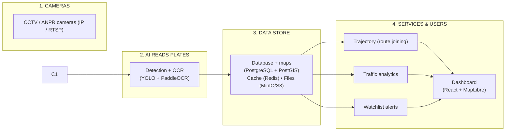

## System Architecture (v0)

The drawing below divides the system into **four simple layers**. Each layer shows only the **pipeline name** with the **key technology** used.

> Every camera frame flows through the same path. The result splits into **two things officials want**: tracking one plate (for safety) and seeing the whole city's traffic (for planning) — using the same data.

---